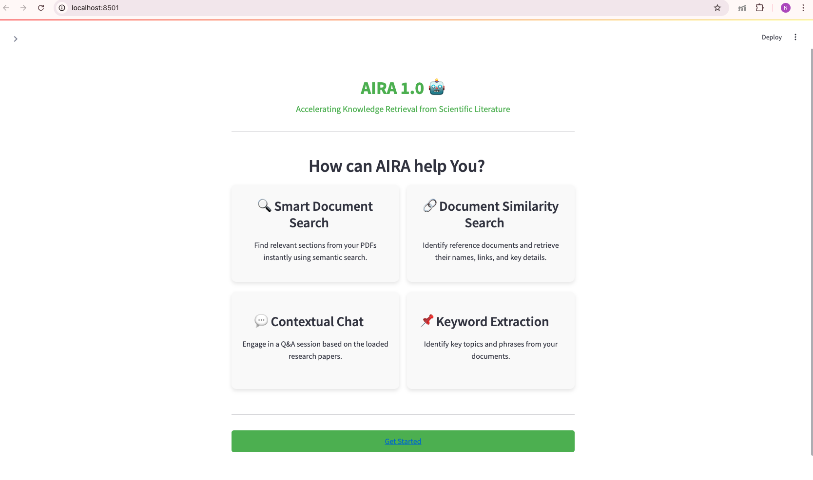
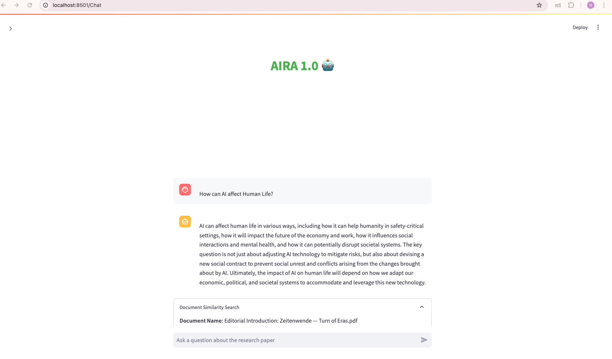
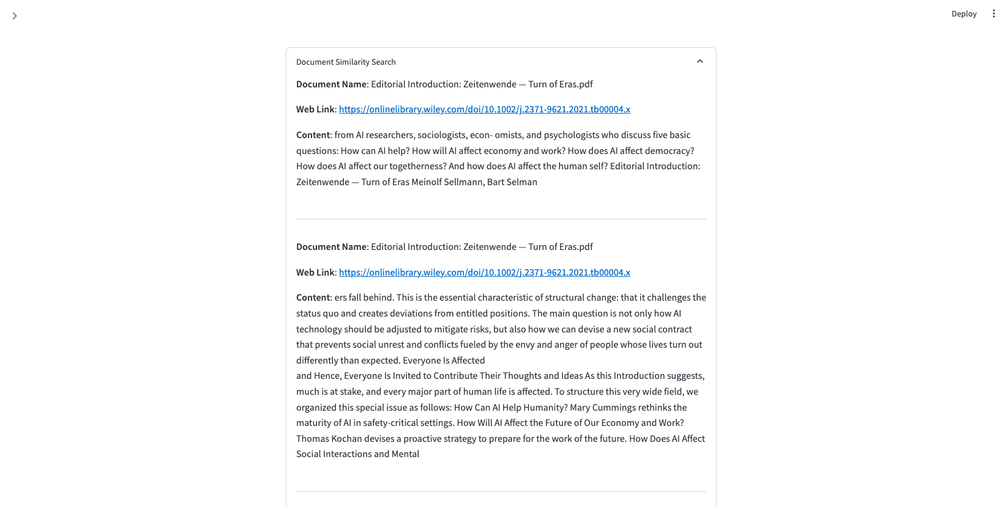

# 🧠 AIRA 1.0 – AI-powered Research Assistant


**AIRA 1.0 (Artificial Intelligence Research Assistant)** is an intelligent, interactive assistant built with Streamlit and LangChain that enables users to query research papers, retrieve contextual information, and extract insights effortlessly. Tailored for academics, researchers, and professionals, AIRA accelerates the understanding of scientific literature using advanced NLP and semantic search.

---

## 🖼️ Preview

### 🔹 Home Page UI


### 🔹 Chat Interface & Document Similarity Output



---

## 🚀 Features

- 🔍 **Smart Document Search**  
  Instantly find relevant content from research papers using semantic search and vector embeddings.

- 🔗 **Document Similarity Search**  
  Identify similar documents and access key metadata, links, and contextual snippets.

- 💬 **Contextual Q&A Chat**  
  Ask questions and receive precise answers grounded in the content of your uploaded papers.

- 📌 **Keyword Extraction (Planned)**  
  Extract key topics and phrases to better understand document themes.

---

## 📁 Project Structure

```
├── app.py                  # Main chat interface
├── Home.py                 # Landing page with feature descriptions
├── xlsx_to_dict.py         # Extracts titles and URLs from Excel
├── TA.xlsx                 # Excel file with PDF titles and links
├── styles.md               # Custom CSS styling for Streamlit UI
├── requirements.txt        # Python dependencies
├── Web scraping.ipynb      # (Optional) Data scraping logic
```

---

## 🧩 Tech Stack

- **Frontend/UI:** Streamlit  
- **Backend:** Python, LangChain, FAISS, Hugging Face Embeddings  
- **Models:** OpenAI GPT (via LangChain)  
- **Data Handling:** Pandas, PyPDF, openpyxl  
- **Cloud Integration:** dotenv for secure API key loading  
- **Styling:** Custom CSS via `styles.md`

---

## 🛠️ Installation

1. **Clone the repository:**
   ```bash
   git clone https://github.com/your-username/aira-1.0.git
   cd aira-1.0
   ```

2. **Install dependencies:**
   ```bash
   pip install -r requirements.txt
   ```

3. **Set up environment variables:**
   Create a `.env` file with your OpenAI API key:
   ```
   OPENAI_API_KEY=your-openai-api-key
   ```

4. **Run the app:**
   ```bash
   streamlit run Home.py
   ```

---

## 👥 Contributors

- **Prasanth Bysani** – UI/UX Styling & System Integration  
- **Nithyasree Kusakula** – NLP Workflow Design, Semantic Search Development, Front-End Integration  
- **Navyamsh Gangavaram** – PDF Link Extraction Logic & Data Structuring

---

## 📌 Future Enhancements

- Add support for keyword/topic extraction using transformer models.
- Integrate document summarization using LLMs.
- Enable file upload functionality for dynamic document ingestion.
